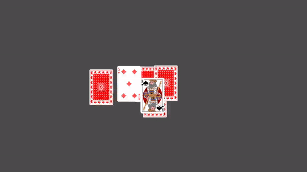

# Cardable w/ Godot

This is a card game "engine" used to play with playing cards in a sandbox environment! Please note that initial builds will have a very constrained set of actions that can be performed, so it won't actually be a sandbox.

Makes use of [Godot 4 2D engine](https://godotengine.org/).

## How to play ?

Since the game is still in active development, to play this game you will have to have Godot 4 installed on your device. Be advised that there's currently nothing to actually _play_.

1. Download and install Godot 4 from their [website](https://godotengine.org/download/).
2. Download this git repository by clicking the green "Code" button, then clicking "Download ZIP".
3. Open Godot 4 executable, then select "Import Project" and then you can either Edit or Run the game from the Godot launcher.

## What's on the development path ?

There are always more and more extensive things that can be done, but currently here are some of the proposed features/gameplay ideas:

- Provide the user an interface to define actions that can be performed and what can be done when.
  - The user defined actions can peform any number of base, `primitive` actions, such as draw card, flip card, shuffle deck, discard card, move card, check card values, give card to player's hand, etc. e.g. a user defined action could be to draw 3 cards at once and place them facedown in front of a player and then provide the player with a choice of which card to discard, then the 2 remaining cards flip to reveal some total summed value.
- Create a custom deck that contains a custom set of cards, and have multiple presets. e.g. deck of cards with equivalent of 2 playing card decks (104 cards), deck with more or less than 4 suits, deck with any number of jokers.
  - Allow user to provide `.config` file that can define completely new cards with custom art/textures and allow decks to be build using these cards or a mix with the regular playing cards.
- Multiplayer!
  - Have a DM/GM/dealer player, who controls the game for all the other players.
    - Allow GM to also play as a normal player at the same time?
  - Regular players will have less actions available to them and can only perform a small subset of actions the GM can do, and they can only interact with their own cards.
  - Players are separated to their own `tables` and can switch their camera around to view other player's `tables`.
- Have a few different default rulesets that come with the game which can be used immediately and act as examples of how to create your own ruleset.
  - Users can create their own rulesets with their own custom cards and define custom behaviour/actions.
  - Rulesets would control how a `round/game` is played and define what can and cannot be done by the GM and regular players. Also controls how the player's are organized, for example if they are all at their own tables or if they share a table and if so, which part of the table is considered theirs.
  - Potential example default rulesets: Blackjack/21, Go Fish, Texas Hold 'em/Poker, etc.

## License ?

Currently the code and Godot project files for this game are considered __PROPRIETARY__. You can freely download the code and run the game, and edit it, as long as you __DO NOT__ _share_, _distribute_, _commercialize_, or _otherwise make use of to make a profit from_ the result. This work may make use of freely available assets, I am not claiming ownership of these assets. If you make changes to the game and want those changes reflected in the final product, you can submit a Pull Request and you can be added to the credits.

I do not own the following assets:

- `deck_placeholder.png`: David Bellot - Berkeley, CA, USA 08/12/2005 - David's web, [LGPL](http://www.gnu.org/licenses/lgpl.html), via [Wikimedia Commons](https://commons.wikimedia.org/wiki/File:Card_back_01.svg).
- Card image files, `00_00.png` .. `03_12.png`: WikimediaImages on Pixabay.com, [link to pixabay](https://pixabay.com/images/id-884206/).
  - Any changes to the resultings images were made by me.

## Credits

Currently this project is only being worked on by myself.

Attribution for this project goes to:

- [TristanTurcotte on GitHub](https://github.com/TristanTurcotte) for the code, programmer art, and design.
